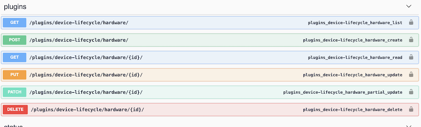
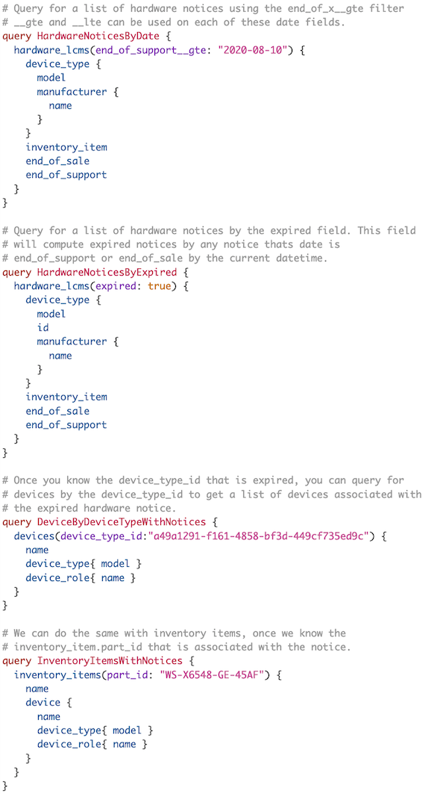
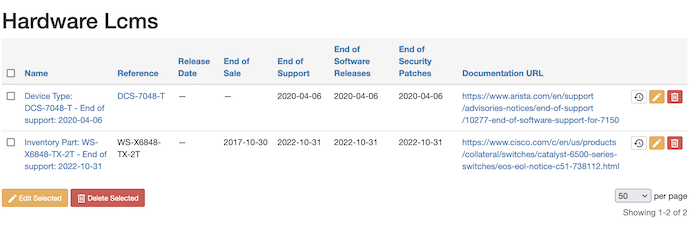
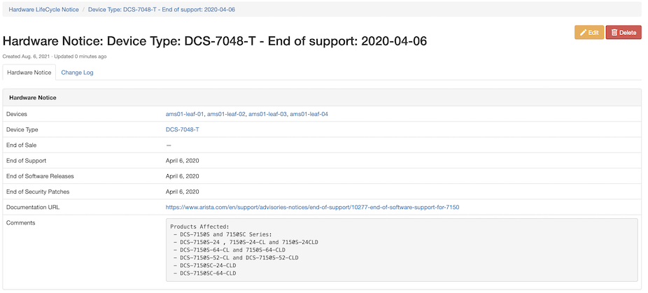
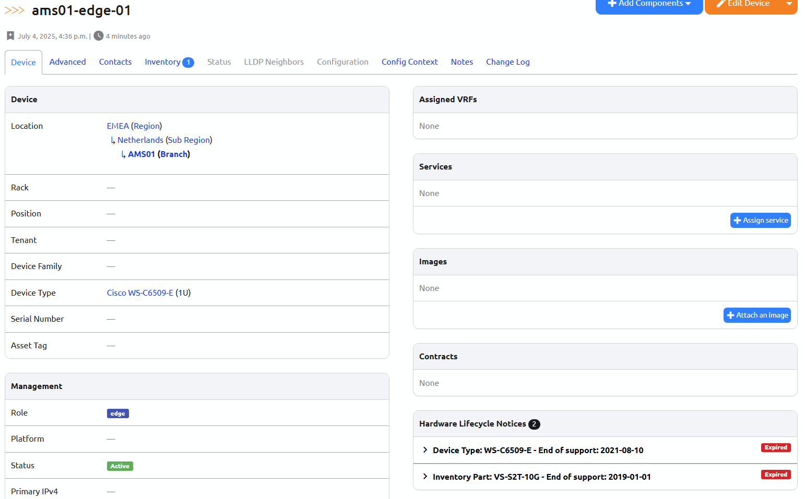
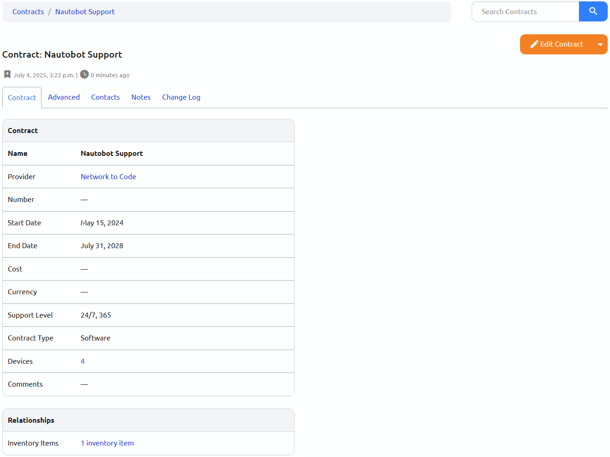
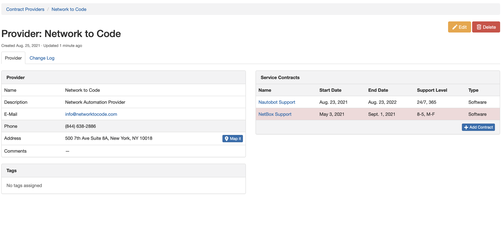

# Nautobot Plugin - Device Lifecycle Management

A plugin for [Nautobot](https://github.com/nautobot/nautobot) to manage device lifecycles. This plugin works by making related associations to Devices, Device Types, and Inventory Items to help provide data about the hardware end of life notices, appropriate software versions to be running on the devices, and the maintenance contracts associated with devices. This will help with the various aspects of planning life cycle events, and provides quick access to ancillary data about the devices in Nautobot.

## Installation

### Installation

The plugin is available as a Python package in pypi and can be installed with pip

```shell
pip install nautobot-device-lifecycle-mgmt
```

> The plugin is compatible with Nautobot 1.0.1 and higher

To ensure Nautobot Device Life Cycle Management plugin is automatically re-installed during future upgrades, create a file named `local_requirements.txt` (if not already existing) in the Nautobot root directory (alongside `requirements.txt`) and list the `nautobot-plugin-device-lifecycle-mgmt` package:

```no-highlight
# echo nautobot-device-lifecycle-mgmt >> local_requirements.txt
```

### Installation Continued

Once installed, the plugin needs to be enabled in your `configuration.py`

```python
# In your configuration.py, if following docs -> /opt/nautobot/nautobot_config.py
PLUGINS = ["nautobot_device_lifecycle_mgmt"]
```

### Run Post Upgrade Steps

Once the configuration has been updated, run the post migration script as the Nautobot user

```
nautobot-server post_upgrade
```

This should run migrations for the plugin to be ready for use.

### Restart Nautobot Services

As a user account that has privileges to restart services, restart the Nautobot services

```
sudo systemctl restart nautobot nautobot-worker
```

If you are on Nautobot >= 1.1.0 and have the RQ worker continuing on, also restart the RQ worker service.

```
sudo systemctl restart nautobot-rq-worker
```

## Usage

### Adding Information into the Plugin

The system currently has manual/API entry of data only. There are currently no connections to any particular vendor APIs that provide this data today. See [adding data docs](docs/add_information.md) for more info.
### Hardware LifeCycle Management
#### API


##### REST API Example 1
Gather hardware notices that will be end of support by the end of 2021
```shell script
curl "http://$NBHOST/api/plugins/device-lifecycle/hardware/?end_of_support__lte=2021-12-31" \
-X GET \
-H  "accept: application/json" \
-H  "Authorization: Token $TOKEN" | json_pp
````

##### REST API Example 2
Gather hardware notices that are currently expired. 
> NOTE: `expired` flag will honor `end_of_support` if the field exist for the record. If the field does not exist, `end_of_sale` will be used as the expired field.
```shell script
curl "http://$NBHOST/api/plugins/device-lifecycle/hardware/?expired=true" \  
-X GET \
-H  "accept: application/json" \
-H  "Authorization: Token $TOKEN" | json_pp
```

#### GraphQL Examples


## Contributing

Pull requests are welcomed and automatically built and tested against multiple version of Python and multiple version of Nautobot through TravisCI.

The project is packaged with a light development environment based on `docker-compose` to help with the local development of the project and to run the tests within TravisCI.

The project is following Network to Code software development guideline and is leveraging:

- Black, Pylint, Bandit and pydocstyle for Python linting and formatting.
- Django unit test to ensure the plugin is working properly.

### CLI Helper Commands

The project is coming with a CLI helper based on [invoke](http://www.pyinvoke.org/) to help setup the development environment. The commands are listed below in 3 categories `dev environment`, `utility` and `testing`. 

Each command can be executed with `invoke <command>`. All commands support the arguments `--nautobot-ver` and `--python-ver` if you want to manually define the version of Python and Nautobot to use. Each command also has its own help `invoke <command> --help`

#### Local dev environment

```no-highlight
  build            Build all docker images.
  debug            Start Nautobot and its dependencies in debug mode.
  destroy          Destroy all containers and volumes.
  restart          Restart Nautobot and its dependencies.
  start            Start Nautobot and its dependencies in detached mode.
  stop             Stop Nautobot and its dependencies.
```

#### Utility

```no-highlight
  cli              Launch a bash shell inside the running Nautobot container.
  create-user      Create a new user in django (default: admin), will prompt for password.
  makemigrations   Run Make Migration in Django.
  nbshell          Launch a nbshell session.
```

#### Testing

```no-highlight
  bandit           Run bandit to validate basic static code security analysis.
  black            Run black to check that Python files adhere to its style standards.
  flake8           This will run flake8 for the specified name and Python version.
  pydocstyle       Run pydocstyle to validate docstring formatting adheres to NTC defined standards.
  pylint           Run pylint code analysis.
  tests            Run all tests for this plugin.
  unittest         Run Django unit tests for the plugin.
```

## Screenshots

### Hardware: Device Life Cycle Management List View

You can view the list of Hardware/Software notices as well as filter the table.




### Hardware: Device Life Cycle Management Detail View

You can also click a Hardware/Software Notice and see the detail view. This view provides links to the devices that are part affected by this EoX notice due to their device type.



### Device View

You can also view the associated Hardware notice from the device. If the device is end of life or end of support the notice will be red.



### Device Type View

This provides the same UI element as the device view, but within the specific device type's view.


### Contracts: Device Life Cycle Management Contract Detail View

You can view the details of a contract along with the primary and escalation contacts. This view will also give you an association to the devices under this contract.




### Contracts: Device Life Cycle Management Contract Provider View

You can view the details of a provider, along with a listing of the service contracts associated to the provider. Contracts that are expired will display in red.

