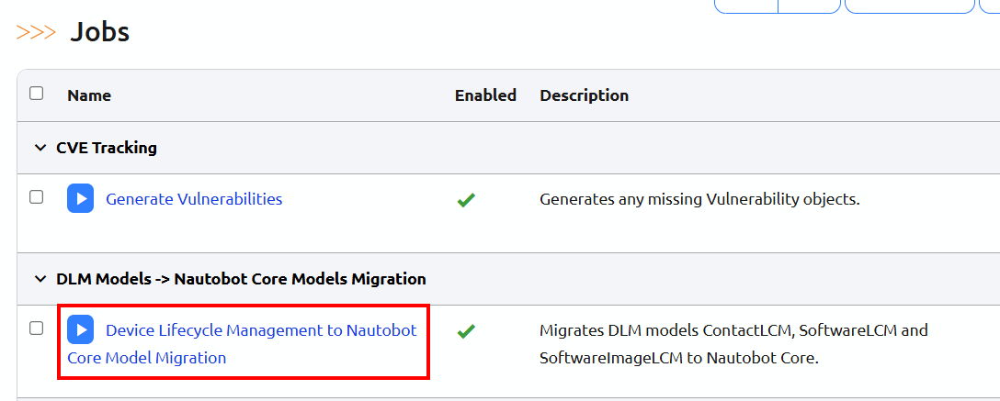
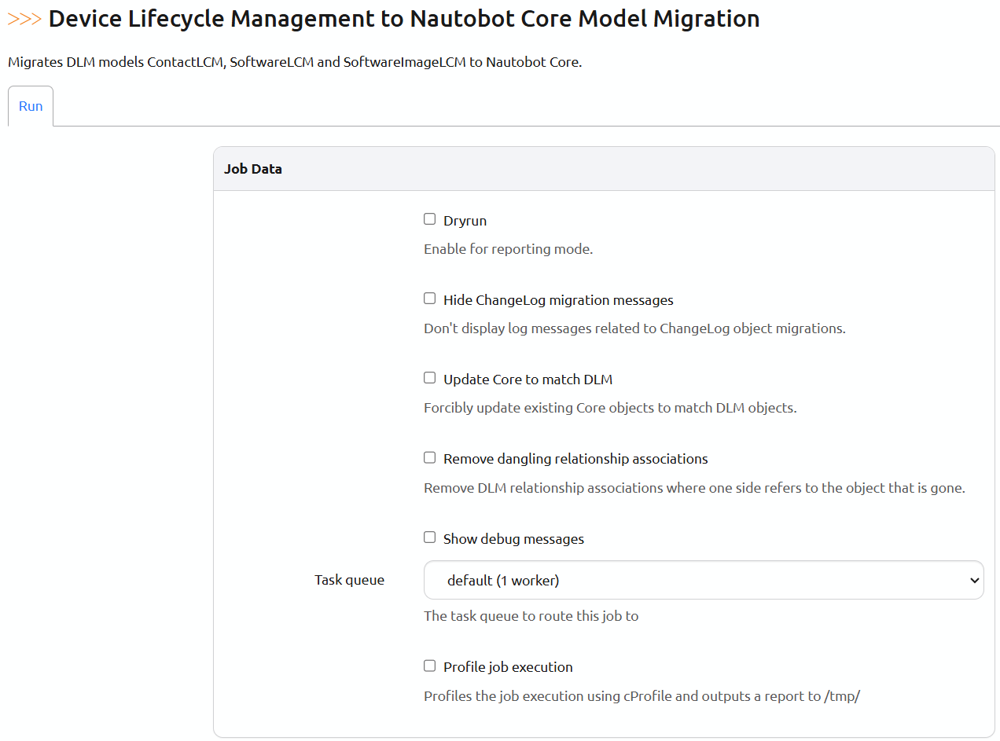

# Migrating to DLM app version 3.0

**Device Lifecycle Management App** version 3.0 now supports these core Nautobot models: SoftwareVersion, SoftwareImageFile, and Contact.

These models were introduced in Nautobot 2.2.0 as functional equivalents to the now deprecated DLM models. **DLM models will be removed in version 4.2**. The table below shows the corresponding model in core that matches each DLM model.

| Core model | DLM model |
| :---- | :---- |
| SoftwareVersion | SoftwareLCM |
| SoftwareImageFile | SoftwareImageLCM |
| Contact | ContactLCM |

The DLM models and their instances will remain in place to ensure a smooth migration and prevent data loss.

After installing app version 3.0, all existing instances of these models must be moved to the core models. This will enable full DLM app functionality. The migration process is outlined in the following sections.

!!! warning
    Please do not install version 3.0.0 and instead upgrade directly to version 3.0.1. Version 3.0.1 fixes a bug in the migrations introduced in version 3.0.0 that could prevent Nautobot from starting for certain combinations of DLM objects.

!!! warning
    Ensure that the DLM app is at least version 3.0.1 and Nautobot is version 2.2.0 or later before starting migration.

## Process of Migration

Before continuing to use the app, it is essential to run the **Device Lifecycle Management to Nautobot Core Model Migration** job, which was introduced in version 3.0. This job migrates existing SoftwareLCM, SoftwareImageLCM, and ContactLCM models to the corresponding core models. Importantly, this job can be run multiple times, allowing existing automation or workflows to continue targeting deprecated models and providing operators with additional control over the update process.

The DLM objects will be marked as migrated by setting a boolean value to true after the job creates instances of core objects that match them and records a reference to the core object on the old DLM object during the migration. The deprecated DLM models have been updated with the attributes below to allow for migration tracking:

* **migrated\_to\_core\_model** \- Foreign Key to the core model instance  
* **migrated\_to\_core\_model\_flag** \- Boolean set to True when the instance is migrated to the core

The migration job generates new core objects that replace the deprecated DLM objects. If a core object already exists that matches the existing DLM object, that may be used instead. If the job encounters an error, it will not rollback any created objects. If an error occurs, check the job logs to identify and resolve the issue, then restart the job. The job will revalidate any objects that have already been migrated and retry the migration for those objects that failed during previous runs. The tool also includes a dry run mode which produces a report that details which objects would be migrated, without making any changes to the system.

If at any point two DLM objects are migrated to the same core object, a warning message will be displayed during the migration. If the initial DLM object was altered between runs of the migration job, the DLM object may need to be manually updated to resolve this issue.

### Extensibility Objects Referencing Deprecated Objects

The migration job will also migrate any extensibility objects connected to the migrated objects, such as custom fields, notes, tags, webhooks, relationships, and others. The relationships and relationship associations that are connected to the migrated DLM objects will be duplicated.

### Relationships Migrations

To maintain existing Relationships and Relationship Associations, we will rename all Relationships that reference migrated models to '{foo}\_old' and create a new relationship called '{foo}' with the same data. The 'source\_type'/'destination\_type' will be updated with the new model's content type. RelationshipAssociations will be duplicated and their content types will also be updated.

The DLM app no longer requires the Software on Device and Software on InventoryItem relationships, as these have been replaced by a new software attribute on the core Device and Inventory Item models. The existing relationships will be migrated to the new attribute, but will also be retained for reference purposes.

### Software Image Hashing Algorithm

The DLM app previously allowed unrestricted text input for the hashing algorithm specified within SoftwareImageLCM instances. However, core SoftwareImageFile now limits hashing algorithm options. The migration job will attempt to map the existing free-form text algorithm onto one of the newly permitted choices. If a match cannot be found, a warning message will be generated, requiring a manual update of the hashing algorithm.

### Software objects migration in Nautobot 2.2.0 to 2.3.0

Nautobot versions 2.2.0-2.3.0 require that at least one software image exists for any software that is assigned to a device. DLM did not have this requirement. In order to migrate SoftwareLCM objects that don't have corresponding SoftwareImageLCM objects, the migration job will create a placeholder SoftwareImageFile in Nautobot core. These images follow the format "{software\_version}-{device\_model}--dlm-migrations-placeholder". Additionally, a note is added to the placeholder SoftwareImageFile object explaining why it was created. The migration job automatically detects if the Nautobot version you are running is affected and won’t create placeholder images for the newer versions. 

### DLM models that now refer to the Core models

The models that previously referenced the deprecated DLM models now reference the core models. The old fields, which have been renamed with the prefix "old\_", remain in place and still reference the deprecated DLM models. The DLM models and their old and new references are outlined in the tables below.

| DLM Object | Core Reference | DLM Reference |
| ----- | ----- | ----- |
| **CVELCM** | affected\_softwares | old\_affected\_softwares |
| **DeviceSoftwareValidationResult** | software | old\_software |
| **InventoryItemSoftwareValidationResult** | software | old\_software |
| **ValidatedSoftwareLCM** | software | old\_software |
| **VulnerabilityLCM** | software | old\_software |

Before continuing to use the following jobs and any associated reports, you must first run the migration job. These jobs previously relied on deprecated DLM objects and now utilize core objects. In the future, please exclusively use the core Software Version and Contact models:

- CVE Tracking \- \> Generate Vulnerabilities  
- Device/Software Lifecycle Reporting \- \> Device Software Validation Report  
- Device/Software Lifecycle Reporting \-\> Inventory Item Software Validation Report

### Migration Banner

DLM views will display a warning banner at the top of the page if any DLM model instances have not yet been migrated to the core models. Please run this migration job as soon as possible before continuing to use the DLM app.

### Accessing Deprecated Models

Deprecated DLM models will be hidden from the GUI, but will remain accessible via API and ORM. This prevents new instances from targeting deprecated models, while allowing users to reference or modify existing data using the API or ORM.

## Running the Migration Job

!!! warning
    This job requires Nautobot 2.2.0 or later.

To execute the Device Lifecycle Management to Nautobot Core Model Migration job, go to the Jobs page and locate it under "DLM Models \-\> Nautobot Core Models Migration" section. The job will need to be enabled before running it the first time.

### Migration Job options

The screenshot shows several options that are available for the migration job. These options are explained below.  

**Dryrun** \- Activate reporting mode to receive informational messages on what the migration job identified for migration. No changes will be made in this mode.

**Hide ChangeLog migration messages** \- Suppress ChangeLog object migration log messages.  
This is recommended if there are numerous ChangeLogs associated with the DLM objects being migrated.

**Update Core to match DLM** \- If this option is enabled, the Job will automatically update the attributes of any existing core object to match those of the DLM object, provided the primary fields of both objects match. If this option is disabled, you must manually update the core object attributes or the DLM object attributes so that they match. The tables below display the attributes that are compared and updated in the event of a discrepancy.

| DLM SoftwareLCM | Core SoftwareVersion |
| ---- | ---- |
| alias | alias |
| release\_date | release\_date |
| end\_of\_support | end\_of\_support\_date |
| documentation\_url | documentation\_url |
| long\_term\_support | long\_term\_support |
| pre\_release | pre\_release |
| \_custom\_field\_data | \_custom\_field\_data |

| DLM SoftwareImageLCM | Core SoftwareImageFile |
| ---- | ---- |
| image\_file\_checksum | image\_file\_checksum |
| hashing\_algorithm | hashing\_algorithm |
| default\_image | default\_image |
| \_custom\_field\_data | \_custom\_field\_data |

| DLM ContactLCM | Core Contact |
| ---- | ---- |
| address | address |
| comments | comments |
| \_custom\_field\_data | \_custom\_field\_data |

**Remove dangling relationship associations** \- Delete relationship associations if the job indicates that the object referenced by the relationship association has been deleted. Relationships modified through ORM or API may sometimes experience this.

**Show debug messages** \- Activate verbose mode for detailed logging.

## FAQ

### I can no longer see Software, Software Image, or POC in the Device Lifecycle UI menu

Access to the deprecated DLM models through the UI has been disabled to prevent confusion with the core models. However, the old DLM objects remain accessible via API and Django ORM. The core software models can be accessed under the `Devices` menu. The core contact model is accessed through the `Organization` menu.

### Will the reporting functionality of Validated Software still work with the deprecated models?

The Validated Software reporting previously used DLM objects, but now utilizes core Software Version objects. Therefore, it is necessary to migrate the outdated DLM objects using the migration job and use the core Software Version for future reporting.

### The automation I use targets deprecated DLM models. Are these models still usable for the time being?

While the deprecated DLM models can still be used to create objects, it's important to note that models referencing SoftwareLCM (like ValidatedSoftwareLCM) will require either the creation of a core SoftwareVersion object first or targeting the attribute referencing the deprecated model. Please refer to the provided table for specific model and attribute names.

### I'm seeing a banner with the message \`Some Device Lifecycle Management models have not been migrated to Nautobot core models…\`

Deprecated DLM objects that have not yet been migrated to their corresponding core models indicate that either:

* The migration job has not been run.  
* The migration job encountered errors, preventing the migration of all objects.  
* New DLM objects were created after the migration job was run.

If this occurs, address any reported errors and rerun the job as necessary to resolve all errors.

### This job is taking a long time.

The initial run of the job can take several hours depending on the number of DLM Software objects and the number of devices to which the DLM Software is assigned.
