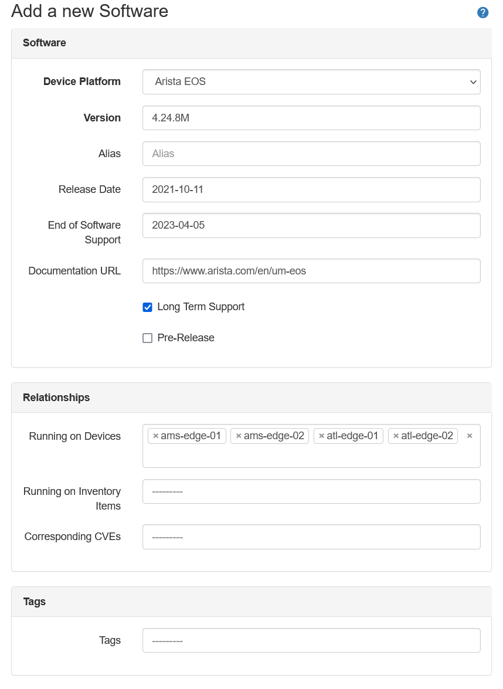
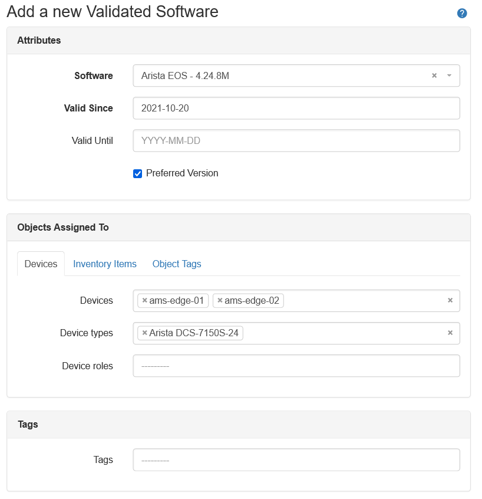

# Software Lifecycle

The Software Lifecycle portion of the plugin helps in managing the lifecycle of the software running on the devices and inventory items.

To help in achieving this goal the plugin provides three types of objects: Software, Software Image and Validated Software.

Software objects can be used on their own and are used to record detailed information about a software release. These objects can then be associated with devices and inventory items to track the versions used by the infrastructure hardware.

Software Image objects are used to record detailed information about software images linked to given Software version. They can be assigned to specific device types, inventory items and object tags.

Validated Software objects are used to specify which versions of the Software are currently valid/approved within the organization, and for which subset of the devices/inventory items. Validated Software requires Software object to be defined before it can be created.

## Software objects

Software objects represent software releases that can be assigned to devices and inventory items.

When creating the Software object, the following fields are available. Fields in **bold** are mandatory.

| Field | Description |
| -- | -- |
| **Device Platform** | Device platform (software family) matching this software release |
| **Version** | Version of the software as specified by the vendor |
| Alias | Arbitrary name that can help distinguish this software inside of the organization |
| Release Date | Date when the software was released |
| End of Software Support | Date when the support for this software version ends |
| Documentation URL | URL pointing to the documentation for this software version |
| Long Term Support | Toggle to specify whether this software is designated as a long term support release |
| Pre-Release | Toggle to specify whether this is a beta/pre-release version of the software |
| Running on Devices | List of devices having this software assigned |
| Running on Inventory Items | List of inventory items having this software assigned |
| Tags | Arbitrary tags that can be applied to this software |

Example of a Software object with most fields filled in:



## Software Image objects

When creating the Software Image object, the following fields are available. Fields in **bold** are mandatory.

| Field | Description |
| -- | -- |
| **Image File Name** | Name of the image file |
| **Software** | Software object this Software Image object is tied to |
| Download URL | Either internal or external link to the image for this software |
| Image File Checksum | MD5 or SHA checksum of the image file |
| Default Image | Marks this Software Image as the default image for the linked Software version |
| Device Types -> Device types | Devices having these device types use this software image |
| Inventory Items -> Inventory items | Inventory items whose software use this software image |
| Object Tags -> Object tags | Devices and Inventory items with these tags use this software image |

Example of a Software object with most fields filled in:


## Software Image assignment rules

Validated Image object can be assigned to:

- device types
- inventory items
- object tags applied to devices and inventory items

## Software Image constraints

The following constrains apply to the Software Image objects:

- Software Image file name must be unique across images linked to one Software version.
- Only one default Software Image per Software version is allowed.
- If Software Image is marked as the default, it cannot be assigned to specific objects. That it is, Software Image is either the default OR it applies to selected device types/inventory items/object tags.
- No more than one Software Image, for given Software version, can be assigned to given device types/inventory items/object tags.
- If Software Image is not marked as default or assigned to any objects, it won't be taken into account when computing software images for end objects (devices, inventory items).

## Software Image - matching to devices and inventory items

When using List view search form, or API, it's possible to pass device name, device id or inventory id as a filter. Plugin will then attempt to find a Software Image object that applies to devices and inventory items.

To find a software image assigned to an object, that object must have Software assigned, and that Software must have at least Software Image linked to it.

Order of preference:
  - One of the Object Tags assigned to Software Image matches tag on Device/Inventory Item
  - One of the Device Types assigned to Software Image matches the device type assigned to the Device
  - One of the Inventory Items assigned to Software Image matches the inventory item
  - Software Image marked as the default image

**REST API example**

Query:

```
GET {{NAUTOBOT_URL}}/api/plugins/nautobot-device-lifecycle-mgmt/software-image/?device_name=ams-leaf-02
```

Response:

```json
{
    "count": 1,
    "next": null,
    "previous": null,
    "results": [
        {
            "id": "a4ca2d1b-77d4-48a1-a7f4-caa67d0677fa",
            "url": "http://172.29.183.193:8080/api/plugins/nautobot-device-lifecycle-mgmt/software-image/a4ca2d1b-77d4-48a1-a7f4-caa67d0677fa/",
            "image_file_name": "4.24.8tag.img",
            "software": {
                "id": "271ea021-69fd-4d8d-8cff-d367fa30ef08",
                "url": "http://172.29.183.193:8080/api/plugins/nautobot-device-lifecycle-mgmt/software/271ea021-69fd-4d8d-8cff-d367fa30ef08/",
                "device_platform": "835e363f-c922-4540-b0c0-aaeac2a1be15",
                "version": "4.24.8M",
                "end_of_support": "2023-04-05",
                "display": "Arista EOS - 4.24.8M"
            },
            "device_types": [],
            "inventory_items": [],
            "object_tags": [
                "2b7bc5dc-a640-4686-b887-8986f1a2a5e2",
                "e0df521c-b772-4581-a0a3-d6cd7c1c2b2b"
            ],
            "download_url": "",
            "image_file_checksum": "",
            "default_image": false,
            "custom_fields": {},
            "tags": [],
            "display": "4.24.8tag.img"
        }
    ]
}

```

**GraphQL API example**

Query:

```graphql
query {
  software_images(device_name: "ams-leaf-02") {
    software {
      version
    }
    image_file_name
    image_file_checksum
    download_url
  }
}
```

Response:

```json
{
  "data": {
    "software_images": [
      {
        "software": {
          "version": "4.24.8M"
        },
        "image_file_name": "EOS-4.24.8M.swi",
        "image_file_checksum": "EOS-4.24.8M.swi",
        "download_url": "ftp://images.internal/eos/EOS-4.24.8M.swi"
      }
    ]
  }
}
```

## Validated Software objects

Validated Software objects are used to check if the software assigned to devices and inventory items is valid/approved.

These objects represent rules defined in an organization during the software approval/qualification process.

Multiple Validated Software objects can be created for the same software. This allows specifying different validity periods and preference settings for different subsets of devices and inventory items.

When creating the validated software the following fields are available. Fields in **bold** are mandatory.

| Field | Description |
| -- | -- |
| **Software** | Software object this Validated Software object is tied to |
| **Valid Since** | Start date when the rules defined by this object start applying |
| Valid Until | End date when the rules defined by this object stop applying |
| Preferred Version | Whether the Software specified by this Validated Software should be considered a preferred version |
| Devices -> Devices | Devices whose software will be validated by this Validated Software |
| Devices -> Device types | Devices having these device types will have software validated by this Validated Software |
| Devices -> Device roles | Devices having these device roles will have software validated by this Validated Software |
| Inventory Items -> Inventory items | Inventory items whose software will be validated by this Validated Software |
| Object Tags -> Object tags | Devices and Inventory items with these tags will be validated by this Validated Software |

Example of a Validated Software object with most fields filled in:



## Validated Software assignment rules

Validated Software object can be assigned to:

- devices
- device types
- device roles
- inventory items
- object tags applied to devices and inventory items

One Validated Software object can be assigned to multiple other objects.

## Validated Software matching logic

When a device or inventory item has Software assigned plugin will attempt to find a Validated Software object that is linked to the Software and matches the device/inventory item through assignment resolution.

If at least one Validated Software object, which is currently valid, matching Software and device/inventory item is found, then the Software is marked as valid. Otherwise, it is marked as invalid.

When resolving whether Validated Software is taken into account when validating software on a given device, the following logic applies.

For device, Validated Software will be used if one, or more, of the following, applies:

- Device is explicitly listed in the Validated Software `devices` attribute.
- Device's device type AND device role match `device_types` AND `device_roles` in Validated Software. This applies only if BOTH are set. See the **Special cases** subsection that follows.
- Device's device type is listed in the Validated Software `device_types` attribute.
- Device's role is listed in the Validated Software `device_roles` attribute.
- Device's tags are listed in the Validated Software `object_tags` attribute.

For inventory items, Validated Software will be used if one, or more, of the following, applies:

- Inventory item is explicitly listed in the Validated Software `devices` attribute.
- Inventory item's tags are listed in the Validated Software `object_tags` attribute.

### Special cases - device type and device role defined together

When a Validated Software object is assigned to both device type and device role then these are used in conjunction (logical AND). That is, such an object will apply to devices that are assigned both, specified device type AND device role.

This logic is used to allow to specify a subset of the devices of a given type by adding additional constraint in the form of device role.

For example, in the below case **Validated Software 4.21M** will apply to **Device 1** only since **Device 2** has a match for device type only.

- Device 1
    - device type: 7150-S64
    - device role: leaf
    - software: 4.21M

- Device 2
    - device type: 7150-S64
    - device role: edge
    - software: 4.21M

- Validated Software - 4.21M:
  - device types: 7150-S64
  - device roles: leaf
  - software: 4.21M

### Behavior when using API to retrieve Validated Software list for devices and inventory items

By default when retrieving a list of Validated Software objects it is possible to filter results by assignments used when the object was created.

To get a list of Validated Software objects that match given device/inventory item matching using the logic described in the previous section, one must specify one of the below parameters:

- For devices: `device_name` or `device_id`
- For inventory items: `inventory_item_id`

#### API Examples for getting Validated Software matching specific objects

1. Return Validated Software objects taken into account when validating software assigned to device `ams-leaf-01`.

    **GraphQL**

    ```
    query {
    validated_softwares(device_name: "ams-leaf-01") {
        preferred
        software {
        version
        }
    }
    ```

    ```json
    {
        "data": {
            "validated_softwares": [
                {
                    "software": {
                        "version": "4.25.6M"
                    },
                    "preferred": true
                },
                {
                    "software": {
                        "version": "4.23.10M"
                    },
                    "preferred": false
                }
            ]
        }
    }
    ```

    **REST API**

    ```
    {{NAUTOBOT_URL}}/api/plugins/nautobot-device-lifecycle-mgmt/validated-software/?device_name=ams-edge-01
    ```

    ```json
    {
        "count": 2,
        "next": null,
        "previous": null,
        "results": [
            {
                "id": "94aabc58-7654-40b0-9d6a-2a71f6b2449c",
                "url": "https://demo.nautobot.com/api/plugins/nautobot-device-lifecycle-mgmt/validated-software/94aabc58-7654-40b0-9d6a-2a71f6b2449c/",
                "software": {
                    "id": "96dba607-19b2-4875-8d02-a8b4667afd69",
                    "url": "https://demo.nautobot.com/api/plugins/nautobot-device-lifecycle-mgmt/software/96dba607-19b2-4875-8d02-a8b4667afd69/",
                    "device_platform": "835e363f-c922-4540-b0c0-aaeac2a1be15",
                    "version": "4.25.6M",
                    "end_of_support": null,
                    "display": "Arista EOS - 4.25.6M"
                },
                "devices": [],
                "device_types": [
                    "b77ff7f2-c9ac-49f1-a74e-9dc32545ce1e"
                ],
                "device_roles": [],
                "inventory_items": [],
                "object_tags": [
                    "dcde1fc2-8f55-44f7-bc17-155e5e7d944d"
                ],
                "start": "2021-06-15",
                "end": "2023-11-23",
                "preferred": true,
                "valid": true,
                "custom_fields": {},
                "tags": [],
                "display": "Arista EOS - 4.25.6M - Valid since: 2021-06-15"
            },
            {
                "id": "d59231fe-24aa-45ec-b21b-3cdeac6f88a1",
                "url": "https://demo.nautobot.com/api/plugins/nautobot-device-lifecycle-mgmt/validated-software/d59231fe-24aa-45ec-b21b-3cdeac6f88a1/",
                "software": {
                    "id": "1fec053e-8c47-4616-ba8e-76ed5f1ff852",
                    "url": "https://demo.nautobot.com/api/plugins/nautobot-device-lifecycle-mgmt/software/1fec053e-8c47-4616-ba8e-76ed5f1ff852/",
                    "device_platform": "835e363f-c922-4540-b0c0-aaeac2a1be15",
                    "version": "4.23.10M",
                    "end_of_support": null,
                    "display": "Arista EOS - 4.23.10M"
                },
                "devices": [],
                "device_types": [
                    "d84c1995-f70a-4658-b53e-14ee4dad8423"
                ],
                "device_roles": [
                    "033cf40f-f739-4864-b65f-4e612530d59a"
                ],
                "inventory_items": [],
                "object_tags": [],
                "start": "2020-09-15",
                "end": "2022-03-09",
                "preferred": false,
                "valid": true,
                "custom_fields": {},
                "tags": [],
                "display": "Arista EOS - 4.23.10M - Valid since: 2020-09-15"
            }
        ]
    }
    ```

2. Return Validated Software objects taken into account when validating software assigned to inventory item with id `ams-leaf-01`.

    **GraphQL**

    ```
    query {
        validated_softwares(inventory_item_id: "33b0c49e-0ee9-409c-b136-f008a3cdf033") {
            software {
                version
            }
            preferred
        }
    }
    ```

    ```json
    {
    "data": {
        "validated_softwares": [
        {
            "software": {
            "version": "4.25.6M"
            },
            "preferred": true
        }
        ]
    }
    }
    ```

    **REST API**

    ```
    {{NAUTOBOT_URL}}/api/plugins/nautobot-device-lifecycle-mgmt/validated-software/?inventory_item_id=33b0c49e-0ee9-409c-b136-f008a3cdf033
    ```

    ```json
    {
        "count": 1,
        "next": null,
        "previous": null,
        "results": [
            {
                "id": "94aabc58-7654-40b0-9d6a-2a71f6b2449c",
                "url": "https://demo.nautobot.com/api/plugins/nautobot-device-lifecycle-mgmt/validated-software/94aabc58-7654-40b0-9d6a-2a71f6b2449c/",
                "software": {
                    "id": "96dba607-19b2-4875-8d02-a8b4667afd69",
                    "url": "https://demo.nautobot.com/api/plugins/nautobot-device-lifecycle-mgmt/software/96dba607-19b2-4875-8d02-a8b4667afd69/",
                    "device_platform": "835e363f-c922-4540-b0c0-aaeac2a1be15",
                    "version": "4.25.6M",
                    "end_of_support": null,
                    "display": "Arista EOS - 4.25.6M"
                },
                "devices": [],
                "device_types": [
                    "b77ff7f2-c9ac-49f1-a74e-9dc32545ce1e"
                ],
                "device_roles": [],
                "inventory_items": [],
                "object_tags": [
                    "dcde1fc2-8f55-44f7-bc17-155e5e7d944d"
                ],
                "start": "2021-06-15",
                "end": "2023-11-23",
                "preferred": true,
                "valid": true,
                "custom_fields": {},
                "tags": [],
                "display": "Arista EOS - 4.25.6M - Valid since: 2021-06-15"
            }
        ]
    }
    ```


### Ordering of the Validated Software objects in a list

A given device/inventory item can be matched by multiple Validated Software objects.

If there is more than one Validated Software object matching software assigned to the device/inventory item then the list of Validated Software objects ordered according to the following rules.

#### Ordering for devices

1. Device is listed in the `devices` attribute, `preferred` flag set to `True`
2. Device's device type AND device role are listed in the `device_types` and `device_roles` attributes,  `preferred` flag set to `True`
3. Device's device type is listed in the `device_types` attribute, `preferred` flag set to `True`
4. Device's device role is listed in the `device_roles` attribute, `preferred` flag set to `True`
5. Device's tag is listed in the `object_tags` attribute, `preferred` flag set to `True`
6. Device is listed in the `devices` attribute, `preferred` flag set to `False`
7. Device's device type AND device role are listed in the `device_types` and `device_roles` attributes,  `preferred` flag set to `False`
8. Device's device type is listed in the `device_types` attribute, `preferred` flag set to `False`
9. Device's device role is listed in the `device_roles` attribute, `preferred` flag set to `False`
10. Device's tag is listed in the `object_tags` attribute, `preferred` flag set to `False`

#### Ordering for inventory items

1. Inventory item is listed in the `inventory_items` attribute, `preferred` flag set to `True`
2. Inventory item's tag is listed in the `object_tags` attribute, `preferred` flag set to `True`
3. Inventory item is listed in the `inventory_items` attribute, `preferred` flag set to `False`
4. Inventory item's tag is listed in the `object_tags` attribute, `preferred` flag set to `False`

These rules allow preferred and more specific Validated Software objects to be returned first.