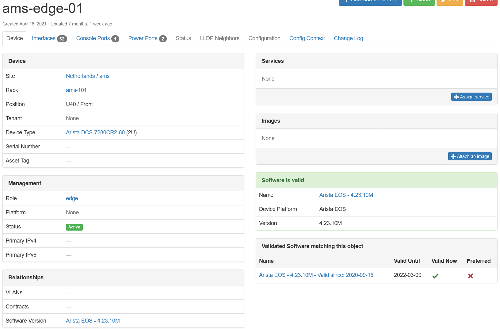
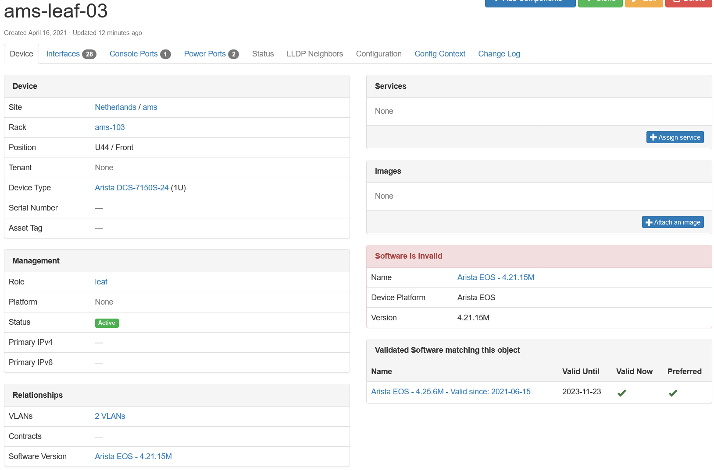

# Using the App

This document describes common use-cases and scenarios for this App.

## General Usage

### Adding Information into the App

To add data into the Device Life Cycle App, you need to either add it manually throughout the UI, or through the REST API endpoint. In this current version there is no synchronization of data from a vendor API endpoint, but this may be a feature request in the future.

#### App API Definition

To add information via the REST API, please look at the Swagger API docs for the app once installed. This will provide you the same documentation for working with other devices.

#### Hardware Lifecycle

When running Nautobot 1.1.0 or later, there is a separate menu added named `Device Lifecycle`. This will be seen on the top menu bar. From here you will find the typical navigation for the addition of items. For example, to add a Hardware Notice for end of life, select `Device Lifecycle` -> Plus sign next to `Hardware Notices`. This will bring up the new Hardware notice page. In this page, fill out the appropriate information from the drop down menus to create the hardware notice.

!!! note
    In order for a hardware notice to be created, there must be either an existing Device Type or Inventory Item that can be found in the database. Without these data points, the data cannot be added, as a relationship is built to the particular items.

#### Software Lifecycle

Software follows the same methodology. First you add Software that is applicable for a particular platform. Then fill in the required fields of Version and add the corresponding relationships.

#### Maintenance Contracts

The maintenance contracts has a similar feel as the Circuit Providers as part of the core of Nautobot. There is a `Vendor` that provides the particular maintenance contract. Then individual `Contracts` are associated with the vendor. As an optional add on a Point of Contact can be made to associate with the contract and named escalation tree if required.

### CVE Tracking

Read more about [CVE Tracking](cve_tracking.md).

## Use-cases and common workflows

Read more about [Software Lifecycle](software_lifecycle.md) use-cases.

## Screenshots

### Hardware: Device Lifecycle Management List View

You can view the list of Hardware/Software notices as well as filter the table.

### Hardware: Device Lifecycle Management Detail View

You can also click a Hardware/Software Notice and see the detail view. This view provides links to the devices that are part affected by this EoX notice due to their device type.

### Device View

You can also view the associated Hardware notice from the device. If the device is end of life or end of support the notice will be red.

### Device Type View

This provides the same UI element as the device view, but within the specific device type's view.

### Contracts: Device Lifecycle Management Contract Detail View

You can view the details of a contract along with the primary and escalation contacts. This view will also give you an association to the devices under this contract.

### Contracts: Device Lifecycle Management Contract Provider View

You can view the details of a provider, along with a listing of the service contracts associated to the provider. Contracts that are expired will display in red.

### Software: Software Lifecycle Management List View

You can view the list of Software versions as well as filter the table.

### Software: Software Lifecycle Detail View

You can also click a Software version and see the detail view. This view provides link to the list of devices and inventory items that are associated with this software object.

### Software: Software Image Lifecycle List View

You can view the list of Software Images as well as filter the table.

### Software: Software Image Lifecycle Detail View

You can also click a Software Images image name and see the detail view. This view provides view of the device types and inventory item attributes this software image applies to.

### Software: Validated Software Lifecycle Management List View

You can view the list of Validated Software versions as well as filter the table.

### Software: Validated Software Lifecycle Detail View

You can also click a Validated Software version and see the detail view. This view provides view of the device and inventory item attributes this validated software applies to.

### Software: Device View

You can also view the associated Software and Validated Software versions from the device. If the Software assigned to the device matches Validated Software for this device, the Software will be displayed in green. If it's invalid it will be displayed in red.

**Valid software:**

**Invalid software:**

