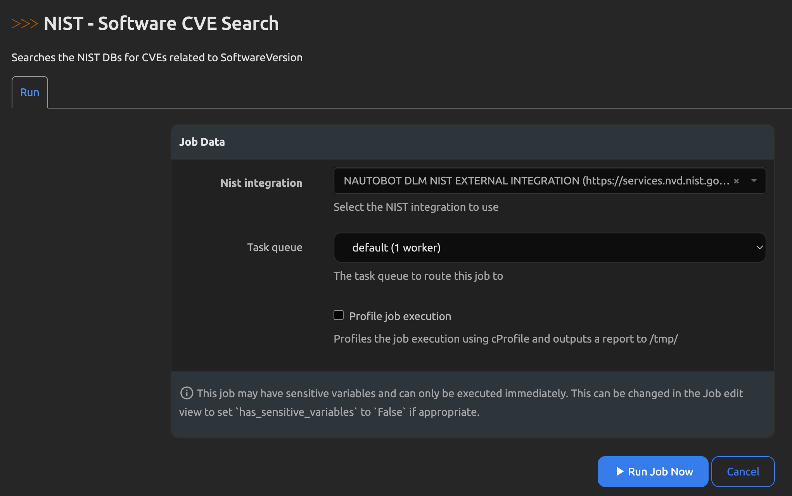

# CVE Tracking

The CVE Tracking portion of the app provides two additional objects - CVE objects and Vulnerability objects.

## CVE objects

A CVE object can be used to record Common Vulnerabilities and Exposures as well as any detailed information that is useful to track about them such as publish date, severity, CVSS scores and more. CVE objects can be used individually, but they can then be [associated](#software-association) to one or many Software objects via a [Relationship](https://docs.nautobot.com/projects/core/en/stable/models/extras/relationship/).

When creating a CVE object, the following fields are available. Fields in **bold** are mandatory.

| Field | Description |
| -- | -- |
| **Name** | The name of the CVE |
| **Published Date** | Date when the CVE was published |
| **Link** | The URL that the CVE details were obtained from |
| Status | The current status of the CVE (requires a [Status object](https://docs.nautobot.com/projects/core/en/stable/models/extras/status/) to be created and associated to the CVE model) |
| Description | The description of the CVE |
| Severity | The severity (Low, Medium, High, Critical) of the CVE |
| CVSS Base Score | The Base (v1) Common Vulnerability Scoring System of the CVE |
| CVSSv2 Score | The CVSSv2 Score |
| CVSSv3 Score | The CVSSv3 Score |
| Fix | The software fix (if available) for the CVE |
| Comments | Any additional comments or details about the CVE |
| Tags | Arbitrary [tag objects](https://docs.nautobot.com/projects/core/en/stable/models/extras/tag/) that can be applied to this CVE |
| Last Modified Date | The date that the CVE record was last modified |

!!! note
    In addition to these standard fields, you can also add one or more [Custom Fields](https://docs.nautobot.com/projects/core/en/stable/models/extras/customfield/) to the model.

### Software Association

As stated previously, you can associate a CVE to one or many [Software objects](./software_lifecycle.md#software-objects). These relationships will present themselves as breadcrumb links on the CVE item's detail view, and as the "Related CVEs" tab on the Software item's detail view.

Example of a breadcrumb link on a CVE item's view:

Example of the "Related CVEs" tab on a Software item's view:

## Vulnerability objects

A Vulnerability object is the representation of a discovered relationship between a CVE object, a Software object and a Device (or Inventory Item) object. Vulnerability objects cannot be created manually, but rather they must be generated via a Job. They require the combination of a CVE object that is associated to a Software object **and** that Software object to be associated to a Device or Inventory Item object in order to be discovered and generated. You can think of Vulnerability objects like an attack surface that was found in your infrastructure that must be mitigated (such as upgrading the affected device to a patched software version).

To generate Vulnerability objects you must run the ``Generate Vulnerabilities`` Job that is packaged as part of this app. One Vulnerability object will be created for **each** unique combination of CVE/Software/Device and CVE/Software/Inventory Item.

!!! note
    When running the ``Generate Vulnerabilities`` Job, if any unique combinations are found that match an existing Vulnerability object, the Job will not create a duplicate object nor modify the existing object.

### Modifying or Removing Vulnerability objects

After a Vulnerability object has been generated, the CVE, Software, Device and Inventory Item fields on that object cannot be modified, however the following fields may be modified (individually or in bulk).

| Field | Description |
| -- | -- |
| Status | The current status of the Vulnerability (requires a [Status object](https://docs.nautobot.com/projects/core/en/stable/models/extras/status/) to be created and associated to the Vulnerability model) |
| Tags | Arbitrary [tag objects](https://docs.nautobot.com/projects/core/en/stable/models/extras/tag/) that can be applied to this CVE |

!!! note
    In addition to these standard fields, you can also add one or more [Custom Fields](https://docs.nautobot.com/projects/core/en/stable/models/extras/customfield/) to the model.

As was stated previously, running the ``Generate Vulnerabilities`` Job will not modify (or delete) any existing Vulnerability objects - **even if the associations that existed previously no longer exist**. You do have the ability to delete one or more Vulnerability objects via the GUI or API. In addition to manually removing a Vulnerability, if any CVE, Software, Device or Inventory Item objects are removed, any Vulnerability objects that reference the deleted items will also be removed automatically.

## Automated CVE Discovery via NIST API 2.0
The NTC Nautobot Device Lifecycle Management app now supports automated CVE discovery via the NIST NVD API 2.0.  This feature is optional and can be enabled by obtaining an API key, updating the necessary Secret, and running the ``NIST - Software CVE Search`` Job. Continue reading for more information.

### External Integration
An External Integration must be created and configured in order to use the NIST NVD API for automatic software CVE discovery. On this note, the following is installed for you:

- A new External Integration object named ``NAUTOBOT DLM NIST EXTERNAL INTEGRATION`` that allows you to control the following behaviors of the integration:
    - ``api_call_delay``: A delay between API calls in seconds (default: 6).  NIST Recommends a value of 6 to prevent overloading resources.
    - ``retries``: Even with using a delay, the NIST API may return a 500 error.  The settings in this dictionary allows you to control the number of retries and their behavior.
        - ``max_attempts``: The maximum number of retry attempts (default: 3).
        - ``delay``: The delay between retry attempts in seconds (default: 1).  This is the initial delay before the first retry.
        - ``backoff``: The backoff factor for the retry attempts (default: 2).  This is the multiplier for the delay between retries.
        - ``status_forcelist``: The status codes that force a retry (default: [500, 502, 503, 504]).
        - ``allowed_methods``: The HTTP methods that are allowed (default: ["GET"]).
- A new Secrets Group object named ``NAUTOBOT DLM NIST SECRETS GROUP`` used for access to the NIST API Key from the External Integration.
- A new Secret object named ``NAUTOBOT DLM NIST API KEY`` that **IS REQUIRED** to be configured. To contain your NIST API Key acquired from [here]('https://nvd.nist.gov/developers/request-an-api-key').

NOTE: You may change the name of the External Integration or create your own using other configuration settings, but the SecretsGroup and Secret objects must be named as above.  The External Integration is selected when starting the Job run.

### Run Job
Automated discovery is used by running the ``NIST - Software CVE Search`` Job.

To run this job, use the "Jobs" menu dropdown and navigate to the **CVE Tracking** section. The jobs will appear here and all you will need to do is click the play button in order to use the default External Integration[^1].  If you have configured additional Integrations, you may select the External Integration that you want to use.  **As stated previously, the name of the External Integration does not matter, but the External Integration must contain a SecretsGroup and Secret named as above**.

The job output should indicate the softwares checked and the amount of CVEs received for that software, as well as the amount of CVEs created.  These will not always be the same.  New CVE will be created for software with existing CVE, also software will share CVEs.

[^1] Warning: If play button is grayed out. You will need to enable the job by clicking on edit button in the row and navigate to "Job" portion and click on "Enable"

### Additional Notes:
Due to the way vendor platform entries vary in NIST, some platforms may work without issue, others may not work so well (false positives/negatives).  Juniper JunOS is a great example and has a custom parser in netutils to handle this.

If the platform you are attempting to gather information from does not work, a custom parser will likely be needed to build a proper NIST search URL.
