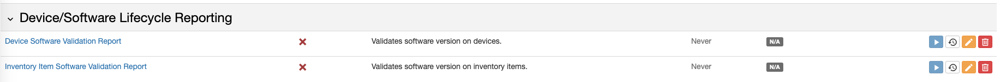
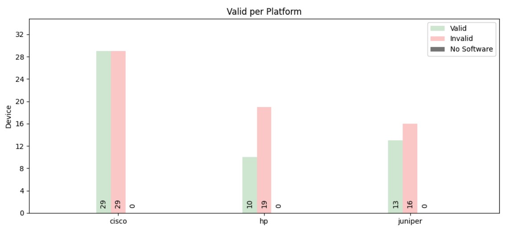
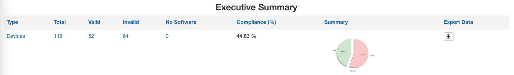
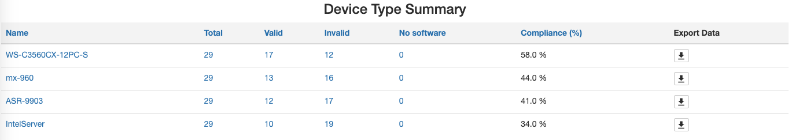
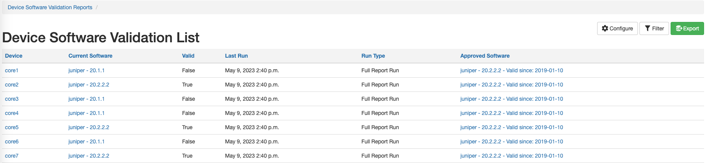
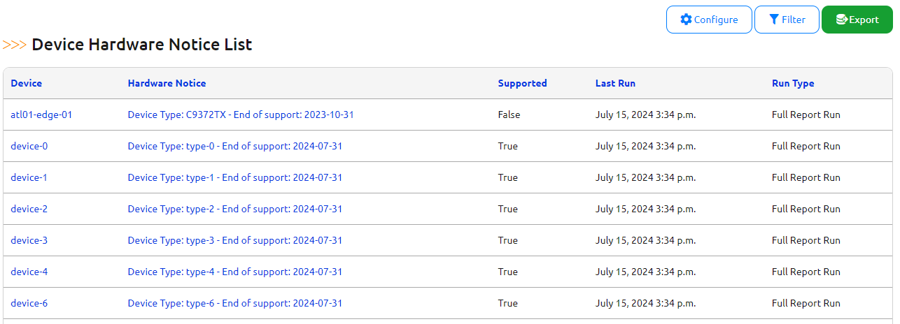
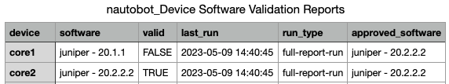
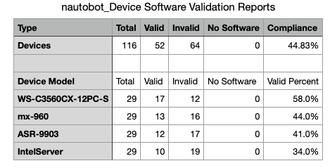
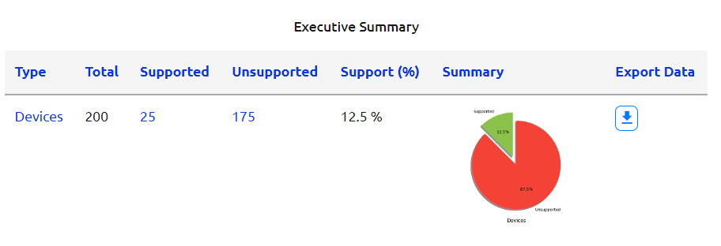
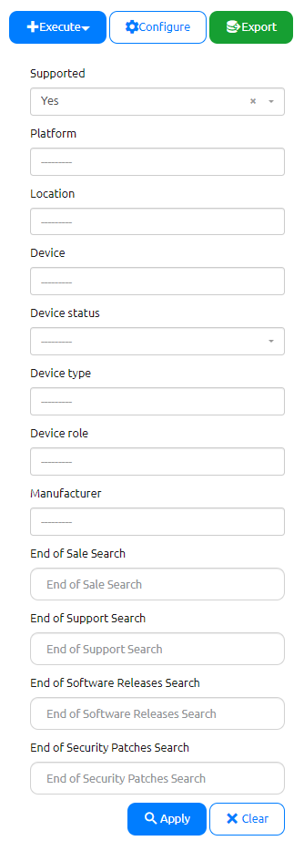

# Lifecycle Reporting

Lifecycle reporting can be seen by running either of the three jobs below:

- Device Software Validation Report
- Inventory Item Software Validation Report
- Device Hardware Notice Report

You can run these reports two ways:

- The "Device Lifecycle" dropdown menu and selecting either **Device Software Validation - Report**, **Inventory Item Software Validation - Report** or **Device Hardware Notice - Report** and then clicking on **Run Software Validation** execute button on right side of screen.


- The "Jobs" dropdown and navigating to **Device/Sofware Lifecycle Reporting** section. The jobs will appear here and all you will need to do is click the play button.  You'll then be able to select the platforms and tenants to run the report for, and click on **Run Job Now** execute button on right side of screen.



!!! warning "If play button is grayed out."
    You will need to enable the job by clicking on edit button in the row and navigate to "Job" portion and click on "Enable"

## Device Software Validation Reports

Once the jobs are ran you can nagivate to the Device Software Validation Reports by selecting **Device Software Validation - Report** or **Inventory Item Software Validation - Report** from the "Device Lifecycle" dropdown menu.

- ** Summary Graph ** - This will have your validated job results per platform



!!! warning "If graph has too many platforms it will not render very well. You can filter it down to only a few with the right side search form. This issue is currenlty being worked on."

- ** Executive Summary ** - Quick summary of all objects found with the report run.



- ** Device Type/Inventory Item Summary ** - Summery of each Device Type or Inventory Item objects found with the report run.



---

From the Device Software Validation and Hardware Notice Reports you can export the report results using the **Export Data** column. The export will be a CVS file. To gather all results export data from the Executive Summary row or you can export each individual Device Type/Inventory Item in its row.

## Validation Results Page

Once the reporting jobs have been run, you can navigate to the results page by selecting **Device Software Validation - List**, **Inventory Item Software Validation - List**, or **Device Hardware Notice - List** from the "Device Lifecycle" dropdown menu.



The software validation list page contains the software report results for each device. All columns are sortable and filters can be applied.

| Column | Description |
| -- | -- |
| **Device/Invenotry Item** | Name of the device/inventory item in the job result. |
| **Current Software** | Software that is currenlty on the device/inventory item. |
| **Valid** | The result of the software validation of the device/inventory item. |
| **Last Run** | Last time the software validation job was ran on the device/inventory item. |
| **Run Type** | Type of software validation job that was ran. |
| **Approved Software** | This is Validated Software object that is associated. This can be a list of softwares. |



The device hardware notice list page contains the hardware notice results for each device. All columns are sortable and filters can be applied.

| Column | Description |
| -- | -- |
| **Device** | Name of the device/inventory item in the job result. |
| **Hardware Notice** | Hardware notice that applies to the device type of the device. |
| **Supported** | Indicates if a device is currently supported based on hardware notice end of support dates. |
| **Last Run** | Last time the hardware notice reporting job was run on the device item. |
| **Run Type** | Type of software validation job that was run. |

## Exporting Software Validation Job Results

There are various ways that you can export the software validation result data to a CSV file.

**Device/Inventory Item Software Validation - Report**

You can export the software validation results using the export button  on the row, which will give you more details of the results.



If you hit the export button on the right side it will only give you the summary numbers that are displayed on the page.



If you want all the results click on the export data button on the *Executive Summary* table.

If you are only looking for **individual results** per platform/inventory item you can click on the export data button on that row.

**"Device/Inventory Item Software Validation - List" page**

The export button  on the right pane of the page.

!!! warning "This will export data that is populated on the screen so if there are any filters applied to the list it will only export those filtered items"

## Exporting Device Hardware Notice Report Job Results

There are various ways that you can export the device hardware notice report result data to a CSV file.

**Device Hardware Notice - Report**

From the executive summary table on the device hardware notice report page, click on the export data button. This will export all results, regardless of the filtering applied.



If the report contains a large amount of data, it is recommended to use the green export button at the top of the page instead. This will hand the export job off to a worker and the results will be filtered based on the filter form inputs on the report page.



The same filtering options and export button are available at the top of the **Device Hardare Notice - List** page. Here is an example of the expected output from a CSV export:


|display                      |id                                  |object_type                                              |natural_slug                                  |is_supported|last_run                   |run_type       |device__name|device__tenant__name|device__location__name|device__location__parent__name|device__location__parent__parent__name|hardware_notice__device_type__manufacturer__name|hardware_notice__device_type__model|created                    |last_updated               |
|-----------------------------|------------------------------------|---------------------------------------------------------|----------------------------------------------|------------|---------------------------|---------------|------------|--------------------|----------------------|------------------------------|--------------------------------------|------------------------------------------------|-----------------------------------|---------------------------|---------------------------|
|Device: device-0 - Supported |72f28e66-857d-420b-8557-2224dcbc0103|nautobot_device_lifecycle_mgmt.devicehardwarenoticeresult|device-0__atl01_united-states-of-america_72f2 |True        |2024-07-15T15:34:54.765155Z|full-report-run|device-0    |NoObject            |ATL01                 |United States Of America      |NoObject                              |Cisco                                           |type-0                             |2024-07-10T15:42:55.534185Z|2024-07-15T15:35:03.966590Z|
|Device: device-1 - Supported |437adb20-d063-4e18-b77a-3fee435291c8|nautobot_device_lifecycle_mgmt.devicehardwarenoticeresult|device-1__atl01_united-states-of-america_437a |True        |2024-07-15T15:34:54.765155Z|full-report-run|device-1    |NoObject            |ATL01                 |United States Of America      |NoObject                              |Cisco                                           |type-1                             |2024-07-10T15:42:55.594824Z|2024-07-15T15:35:03.451640Z|
|Device: device-2 - Supported |daad90e0-d040-43c1-9e76-6b3e5cf01c5d|nautobot_device_lifecycle_mgmt.devicehardwarenoticeresult|device-2__atl01_united-states-of-america_daad |True        |2024-07-15T15:34:54.765155Z|full-report-run|device-2    |NoObject            |ATL01                 |United States Of America      |NoObject                              |Cisco                                           |type-2                             |2024-07-10T15:42:55.649116Z|2024-07-15T15:35:03.488177Z|
|Device: device-3 - Supported |65c048f4-2f0e-4969-8ed0-27fc9e520882|nautobot_device_lifecycle_mgmt.devicehardwarenoticeresult|device-3__atl01_united-states-of-america_65c0 |True        |2024-07-15T15:34:54.765155Z|full-report-run|device-3    |NoObject            |ATL01                 |United States Of America      |NoObject                              |Cisco                                           |type-3                             |2024-07-10T15:42:55.701268Z|2024-07-15T15:35:03.528545Z|
|Device: device-4 - Supported |f7c0b7b7-248d-4ba8-b78c-f13c0a43b6cf|nautobot_device_lifecycle_mgmt.devicehardwarenoticeresult|device-4__atl01_united-states-of-america_f7c0 |True        |2024-07-15T15:34:54.765155Z|full-report-run|device-4    |NoObject            |ATL01                 |United States Of America      |NoObject                              |Cisco                                           |type-4                             |2024-07-10T15:42:55.759877Z|2024-07-15T15:35:03.572409Z|
|Device: device-6 - Supported |4d06de0d-df50-4fb2-8c9a-26a55c1a61cd|nautobot_device_lifecycle_mgmt.devicehardwarenoticeresult|device-6__atl01_united-states-of-america_4d06 |True        |2024-07-15T15:34:54.765155Z|full-report-run|device-6    |NoObject            |ATL01                 |United States Of America      |NoObject                              |Cisco                                           |type-6                             |2024-07-10T15:42:55.878211Z|2024-07-15T15:35:03.615186Z|
|Device: device-7 - Supported |c53a4df4-03aa-4db9-931f-dd9277f45b32|nautobot_device_lifecycle_mgmt.devicehardwarenoticeresult|device-7__atl01_united-states-of-america_c53a |True        |2024-07-15T15:34:54.765155Z|full-report-run|device-7    |NoObject            |ATL01                 |United States Of America      |NoObject                              |Cisco                                           |type-0                             |2024-07-10T15:42:55.990971Z|2024-07-15T15:35:04.004111Z|
|Device: device-8 - Supported |1976a33b-1ac3-41ec-b89d-c984fcbb59bd|nautobot_device_lifecycle_mgmt.devicehardwarenoticeresult|device-8__atl01_united-states-of-america_1976 |True        |2024-07-15T15:34:54.765155Z|full-report-run|device-8    |NoObject            |ATL01                 |United States Of America      |NoObject                              |Cisco                                           |type-0                             |2024-07-10T15:42:56.117182Z|2024-07-15T15:35:04.040316Z|


## Validated Software Results List - API

You can gather all the results from report by using the API that is built into Nautobot.

API command

> GET /api/plugins/nautobot-device-lifecycle-mgmt/device-validated-software-result/

Output

```
HTTP 200 OK
API-Version: 1.2
Allow: GET, HEAD, OPTIONS
Content-Type: application/json
Vary: Accept

{
    "count": 1,
    "next": "http://127.0.0.1:8080/api/plugins/nautobot-device-lifecycle-mgmt/device-validated-software-result/?limit=50&offset=50",
    "previous": null,
    "results": [
        {
            "id": "66134b8d-3466-4f3c-8c65-136dad061a5f",
            "display": "Device: core1 - Not Valid",
            "device": {
                "display": "core1",
                "id": "95b61475-0d09-4f65-b2b3-1e7e199264c7",
                "url": "http://127.0.0.1:8080/api/dcim/devices/95b61475-0d09-4f65-b2b3-1e7e199264c7/",
                "name": "core1"
            },
            "software": {
                "display": "juniper - 20.1.1",
                "id": "1eb3ca93-5af4-4ab8-a501-eb9b6d01c39b",
                "url": "http://127.0.0.1:8080/api/plugins/nautobot-device-lifecycle-mgmt/software/1eb3ca93-5af4-4ab8-a501-eb9b6d01c39b/",
                "device_platform": "b2689411-f1db-4a41-b8fa-2babaed5d5e7",
                "version": "20.1.1",
                "end_of_support": null
            },
            "is_validated": false,
            "last_run": "2023-05-09T14:40:45.890392Z",
            "run_type": "full-report-run",
            "valid_software": [
                "e7350b60-8180-4d3e-bccd-3a6dff50fb7c"
            ],
            "url": "http://127.0.0.1:8080/api/plugins/nautobot-device-lifecycle-mgmt/device-validated-software-result/66134b8d-3466-4f3c-8c65-136dad061a5f/",
            "created": "2023-05-09",
            "last_updated": "2023-05-09T14:40:45.973772Z",
            "custom_fields": {},
            "tags": []
        },
    }
}
```

You are able to get the result of if the Device/Inventory Item is valid or not by the "display" key. The key will display the following.

-  "display": "Device: << device.name >> - Not Valid"
-  "display": "Device: << device.name >> - Valid"

## Device Haredware Notice Results List - API

You can gather all the results from the report using the API that is built into Nautobot.

API command

> GET /api/plugins/nautobot-device-lifecycle-mgmt/device-hardware-notice-result/

Output

```
HTTP 200 OK
API-Version: 2.2
Allow: GET, HEAD, OPTIONS
Content-Type: application/json
Vary: Accept

{
    "count": 200,
    "next": "http://localhost:8080/api/plugins/nautobot-device-lifecycle-mgmt/device-hardware-notice-result/?limit=50&offset=100",
    "previous": "http://localhost:8080/api/plugins/nautobot-device-lifecycle-mgmt/device-hardware-notice-result/?limit=50",
    "results": [
        {
            "id": "60fd548e-e625-4094-ada2-692b1f8d924c",
            "object_type": "nautobot_device_lifecycle_mgmt.devicehardwarenoticeresult",
            "display": "Device: device-50 - Not Supported",
            "url": "http://localhost:8080/api/plugins/nautobot-device-lifecycle-mgmt/device-hardware-notice-result/60fd548e-e625-4094-ada2-692b1f8d924c/",
            "natural_slug": "device-50__atl01_united-states-of-america_60fd",
            "is_supported": false,
            "last_run": "2024-07-15T15:34:54.765155Z",
            "run_type": "full-report-run",
            "device": {
                "id": "772d9555-3222-4a88-af2a-d07efaebf0e4",
                "object_type": "dcim.device",
                "url": "http://localhost:8080/api/dcim/devices/772d9555-3222-4a88-af2a-d07efaebf0e4/"
            },
            "hardware_notice": {
                "id": "8fbb9f8c-5bd3-434b-8704-e9ab914e94af",
                "object_type": "nautobot_device_lifecycle_mgmt.hardwarelcm",
                "url": "http://localhost:8080/api/plugins/nautobot-device-lifecycle-mgmt/hardware/8fbb9f8c-5bd3-434b-8704-e9ab914e94af/"
            },
            "created": "2024-07-10T15:42:59.837920Z",
            "last_updated": "2024-07-15T15:34:57.313538Z",
            "notes_url": "http://localhost:8080/api/plugins/nautobot-device-lifecycle-mgmt/device-hardware-notice-result/60fd548e-e625-4094-ada2-692b1f8d924c/notes/",
            "custom_fields": {}
        }
}
```