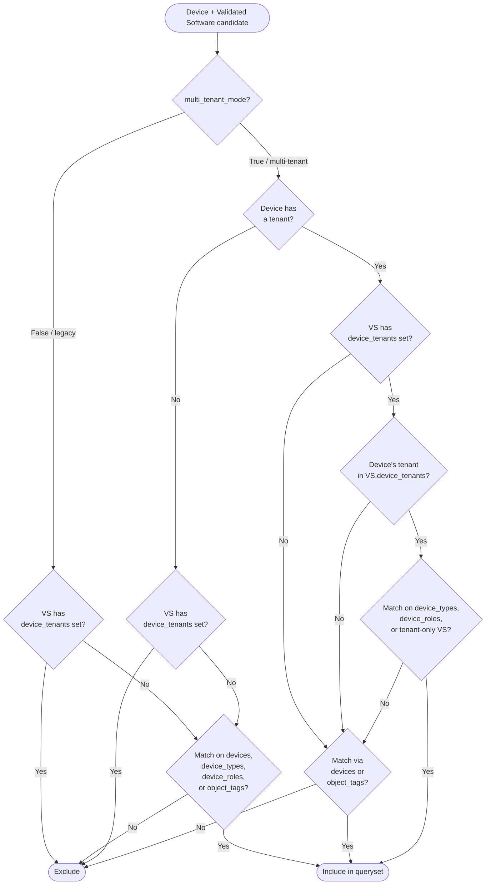

# Software Lifecycle

The Software Lifecycle app, working alongside Nautobot's Software Version model, manages organizationally approved software on devices and inventory.  To achieve this, the app uses a Validated Software model, specifying which Software versions are currently approved within the organization and for which devices or inventory items. A Validated Software object can only be created after a Software object has been defined.

## Validated Software objects

Validated Software objects are used to check if the software assigned to devices and inventory items is valid/approved.

These objects represent rules defined in an organization during the software approval/qualification process.

Multiple Validated Software objects can be created for the same software. This allows specifying different validity periods and preference settings for different subsets of devices and inventory items.

When creating the validated software the following fields are available. Fields in **bold** are mandatory.

| Field | Description |
| -- | -- |
| **Software** | Software object this Validated Software object is tied to |
| **Valid Since** | Start date when the rules defined by this object start applying |
| Valid Until | End date when the rules defined by this object stop applying |
| Preferred Version | Whether the Software specified by this Validated Software should be considered a preferred version |
| Devices -> Devices | Devices whose software will be validated by this Validated Software |
| Devices -> Device tenants | Devices assigned to these tenants will have software validated by this Validated Software. *Only honored when `multi_tenant_mode=True`; ignored by matching in the default legacy mode (see [Multi-tenant mode](#multi-tenant-mode-opt-in)).* |
| Devices -> Device types | Devices having these device types will have software validated by this Validated Software |
| Devices -> Device roles | Devices having these device roles will have software validated by this Validated Software |
| Inventory Items -> Inventory items | Inventory items whose software will be validated by this Validated Software |
| Object Tags -> Object tags | Devices and Inventory items with these tags will be validated by this Validated Software |

Example of a Validated Software object with most fields filled in:

{ .on-glb }
{ .on-glb }
[//]: # "`https://next.demo.nautobot.com/plugins/nautobot-device-lifecycle-mgmt/validated-software/add/`"

## Validated Software assignment rules

Validated Software object can be assigned to:

- devices
- device tenants *(honored only when `multi_tenant_mode=True` — see [Multi-tenant mode](#multi-tenant-mode-opt-in))*
- device types
- device roles
- inventory items
- object tags applied to devices and inventory items

One Validated Software object can be assigned to multiple other objects.

## Multi-tenant mode (opt-in)

The app supports two matching modes for `ValidatedSoftwareLCM` records, controlled by the `multi_tenant_mode` app setting (see the [admin install guide](../admin/install.md#app-configuration)):

| `multi_tenant_mode` | Behavior |
| -- | -- |
| `False` (default) | **Legacy mode** — ValidatedSoftware records with a `device_tenants` assignment are excluded; only untenanted records are considered. The device's own tenant is never checked. Matching within those records uses `devices`, `device_types`, `device_roles`, and `object_tags`. This preserves the pre-tenancy behavior of the app. |
| `True` | **Multi-tenant mode** — the device's tenant must match one of the `device_tenants` on any tenant-scoped Validated Software record for it to apply. Device type, device role, direct device, and tag assignments continue to work, and can be combined with tenant scoping. **No global (untenanted) fallback** is provided for devices that belong to a tenant. |

!!! note
    The `device_tenants` field remains editable in the UI and exposed in the API regardless of the setting. In legacy mode it is simply ignored by matching; existing tenant assignments remain in place and become effective if the setting is later switched to `True`.

!!! warning
    Changing `multi_tenant_mode` requires a Nautobot service restart for the new value to take effect.

!!! warning
    Enabling `multi_tenant_mode` without first creating tenant-scoped Validated Software records will cause all tenanted devices to show zero matching validations. Before switching modes, ensure tenant-scoped Validated Software records exist for every tenant whose devices need coverage.

!!! note
    For tenanted devices in multi-tenant mode, tag-based (`object_tags`) and direct device (`devices`) assignments are tenant-agnostic — a match via these fields does not require the ValidatedSoftware record to be scoped to the device's tenant. In legacy mode and for non-tenanted devices in multi-tenant mode, only ValidatedSoftware records with no tenant assigned are ever returned, regardless of match path.

## Validated Software matching logic

When a device or inventory item has Software assigned app will attempt to find a Validated Software object that is linked to the Software and matches the device/inventory item through assignment resolution.

If at least one Validated Software object, which is currently valid, matching Software and device/inventory item is found, then the Software is marked as valid. Otherwise, it is marked as invalid.

When resolving whether Validated Software is taken into account when validating software on a given device, the following logic applies.

### Matching workflow for devices

The following diagram summarizes how a candidate Validated Software record is accepted or rejected for a given device under each mode. The bullet-list subsections below expand on the individual match criteria referenced in the diagram.



Key points illustrated by the diagram:

- In legacy mode, ValidatedSoftware records with `device_tenants` set are excluded before matching; the device's own tenant is never checked.
- In multi-tenant mode, a tenanted device never falls back to untenanted Validated Software via type/role/tenant paths — only direct `devices` and `object_tags` matches are tenant-agnostic.
- A non-tenanted device in multi-tenant mode only sees untenanted Validated Software; any record with `device_tenants` set is filtered out, including via direct assignment and tags.
- For tenanted devices in multi-tenant mode, direct `devices` and `object_tags` matches are tenant-agnostic and can match VS records with any (or no) tenant assigned.

### For devices — legacy mode (`multi_tenant_mode=False`)

Validated Software will be used if one, or more, of the following applies:

- Device is explicitly listed in the Validated Software `devices` attribute.
- Device's device type AND device role match `device_types` AND `device_roles` in Validated Software. This applies only if BOTH are set. See the **Special cases** subsection that follows.
- Device's device type is listed in the Validated Software `device_types` attribute.
- Device's role is listed in the Validated Software `device_roles` attribute.
- Device's tags are listed in the Validated Software `object_tags` attribute.

Only ValidatedSoftware records with no `device_tenants` set are considered. The device's own tenant has no effect on matching.

### For devices — multi-tenant mode (`multi_tenant_mode=True`)

If the device has a tenant assigned, Validated Software will be used if one, or more, of the following applies:

- Device is explicitly listed in the Validated Software `devices` attribute.
- Device's tenant AND device type match `device_tenants` AND `device_types` in Validated Software. This applies only if BOTH are set. See the **Special cases** subsection that follows.
- Device's tenant AND device role match `device_tenants` AND `device_roles` in Validated Software.
- Device's tenant is listed in the Validated Software `device_tenants` attribute (with no device type set).
- Device's tags are listed in the Validated Software `object_tags` attribute.

If the device has no tenant assigned, only Validated Software records that have **no** `device_tenants` set are considered, and the legacy-mode rules above apply.

### For inventory items

Inventory item matching does not take tenancy into account in either mode. Validated Software will be used if one, or more, of the following applies:

- Inventory item is explicitly listed in the Validated Software `devices` attribute.
- Inventory item's tags are listed in the Validated Software `object_tags` attribute.

### Special cases - device type and device role defined together

When a Validated Software object is assigned to both device type and device role then these are used in conjunction (logical AND). That is, such an object will apply to devices that are assigned both, specified device type AND device role.

This logic is used to allow to specify a subset of the devices of a given type by adding additional constraint in the form of device role.

For example, in the below case **Validated Software 4.21M** will apply to **Device 1** only since **Device 2** has a match for device type only.

- Device 1
    - device type: 7150-S64
    - device role: leaf
    - software: 4.21M

- Device 2
    - device type: 7150-S64
    - device role: edge
    - software: 4.21M

- Validated Software - 4.21M:
    - device types: 7150-S64
    - device roles: leaf
    - software: 4.21M

### Special cases - device tenant and device type defined together

*Only applies when `multi_tenant_mode=True`.*

When a Validated Software object is assigned to both device tenants and device type then these are used in conjunction (logical AND). That is, such an object will apply to devices that are assigned both, specified device tenant AND device type.

This logic is used to allow to specify a subset of the devices of a given type by adding additional constraint in the form of tenant.

For example, in the below case **Validated Software 4.21M** will apply to **Device 1** only since **Device 2** has a match for device type only.

- Device 1
    - device type: 7150-S64
    - device tenants: tenant_A
    - software: 4.21M

- Device 2
    - device type: 7150-S64
    - device tenants: tenant_B
    - software: 4.21M

- Validated Software - 4.21M:
    - device types: 7150-S64
    - device tenants: tenant_A
    - software: 4.21M

### Behavior when using API to retrieve Validated Software list for devices and inventory items

By default when retrieving a list of Validated Software objects it is possible to filter results by assignments used when the object was created.

To get a list of Validated Software objects that match given device/inventory item matching using the logic described in the previous section, one must specify one of the below parameters:

- For devices: `device_name` or `device_id`
- For inventory items: `inventory_item_id`

#### API Examples for getting Validated Software matching specific objects

1. Return Validated Software objects taken into account when validating software assigned to device `ams-leaf-01`.

    **GraphQL**

    ```
    query {
    validated_softwares(device_name: "ams-leaf-01") {
        preferred
        software {
        version
        }
    }
    ```

    ```json
    {
        "data": {
            "validated_softwares": [
                {
                    "software": {
                        "version": "4.25.6M"
                    },
                    "preferred": true
                },
                {
                    "software": {
                        "version": "4.23.10M"
                    },
                    "preferred": false
                }
            ]
        }
    }
    ```

    **REST API**

    ```
    {{NAUTOBOT_URL}}/api/plugins/nautobot-device-lifecycle-mgmt/validated-software/?device_name=ams-edge-01
    ```

    ```json
    {
        "count": 2,
        "next": null,
        "previous": null,
        "results": [
            {
                "id": "94aabc58-7654-40b0-9d6a-2a71f6b2449c",
                "url": "https://demo.nautobot.com/api/plugins/nautobot-device-lifecycle-mgmt/validated-software/94aabc58-7654-40b0-9d6a-2a71f6b2449c/",
                "software": {
                    "id": "96dba607-19b2-4875-8d02-a8b4667afd69",
                    "url": "https://demo.nautobot.com/api/plugins/nautobot-device-lifecycle-mgmt/software/96dba607-19b2-4875-8d02-a8b4667afd69/",
                    "device_platform": "835e363f-c922-4540-b0c0-aaeac2a1be15",
                    "version": "4.25.6M",
                    "end_of_support": null,
                    "display": "Arista EOS - 4.25.6M"
                },
                "devices": [],
                "device_types": [
                    "b77ff7f2-c9ac-49f1-a74e-9dc32545ce1e"
                ],
                "device_roles": [],
                "inventory_items": [],
                "object_tags": [
                    "dcde1fc2-8f55-44f7-bc17-155e5e7d944d"
                ],
                "start": "2021-06-15",
                "end": "2023-11-23",
                "preferred": true,
                "valid": true,
                "custom_fields": {},
                "tags": [],
                "display": "Arista EOS - 4.25.6M - Valid since: 2021-06-15"
            },
            {
                "id": "d59231fe-24aa-45ec-b21b-3cdeac6f88a1",
                "url": "https://demo.nautobot.com/api/plugins/nautobot-device-lifecycle-mgmt/validated-software/d59231fe-24aa-45ec-b21b-3cdeac6f88a1/",
                "software": {
                    "id": "1fec053e-8c47-4616-ba8e-76ed5f1ff852",
                    "url": "https://demo.nautobot.com/api/plugins/nautobot-device-lifecycle-mgmt/software/1fec053e-8c47-4616-ba8e-76ed5f1ff852/",
                    "device_platform": "835e363f-c922-4540-b0c0-aaeac2a1be15",
                    "version": "4.23.10M",
                    "end_of_support": null,
                    "display": "Arista EOS - 4.23.10M"
                },
                "devices": [],
                "device_types": [
                    "d84c1995-f70a-4658-b53e-14ee4dad8423"
                ],
                "device_roles": [
                    "033cf40f-f739-4864-b65f-4e612530d59a"
                ],
                "inventory_items": [],
                "object_tags": [],
                "start": "2020-09-15",
                "end": "2022-03-09",
                "preferred": false,
                "valid": true,
                "custom_fields": {},
                "tags": [],
                "display": "Arista EOS - 4.23.10M - Valid since: 2020-09-15"
            }
        ]
    }
    ```

2. Return Validated Software objects taken into account when validating software assigned to inventory item with id `ams-leaf-01`.

    **GraphQL**

    ```
    query {
        validated_softwares(inventory_item_id: "33b0c49e-0ee9-409c-b136-f008a3cdf033") {
            software {
                version
            }
            preferred
        }
    }
    ```

    ```json
    {
    "data": {
        "validated_softwares": [
        {
            "software": {
            "version": "4.25.6M"
            },
            "preferred": true
        }
        ]
    }
    }
    ```

    **REST API**

    ```
    {{NAUTOBOT_URL}}/api/plugins/nautobot-device-lifecycle-mgmt/validated-software/?inventory_item_id=33b0c49e-0ee9-409c-b136-f008a3cdf033
    ```

    ```json
    {
        "count": 1,
        "next": null,
        "previous": null,
        "results": [
            {
                "id": "94aabc58-7654-40b0-9d6a-2a71f6b2449c",
                "url": "https://demo.nautobot.com/api/plugins/nautobot-device-lifecycle-mgmt/validated-software/94aabc58-7654-40b0-9d6a-2a71f6b2449c/",
                "software": {
                    "id": "96dba607-19b2-4875-8d02-a8b4667afd69",
                    "url": "https://demo.nautobot.com/api/plugins/nautobot-device-lifecycle-mgmt/software/96dba607-19b2-4875-8d02-a8b4667afd69/",
                    "device_platform": "835e363f-c922-4540-b0c0-aaeac2a1be15",
                    "version": "4.25.6M",
                    "end_of_support": null,
                    "display": "Arista EOS - 4.25.6M"
                },
                "devices": [],
                "device_types": [
                    "b77ff7f2-c9ac-49f1-a74e-9dc32545ce1e"
                ],
                "device_roles": [],
                "inventory_items": [],
                "object_tags": [
                    "dcde1fc2-8f55-44f7-bc17-155e5e7d944d"
                ],
                "start": "2021-06-15",
                "end": "2023-11-23",
                "preferred": true,
                "valid": true,
                "custom_fields": {},
                "tags": [],
                "display": "Arista EOS - 4.25.6M - Valid since: 2021-06-15"
            }
        ]
    }
    ```


### Ordering of the Validated Software objects in a list

A given device/inventory item can be matched by multiple Validated Software objects.

If there is more than one Validated Software object matching software assigned to the device/inventory item then the list of Validated Software objects ordered according to the following rules.

#### Ordering for devices

1. Device is listed in the `devices` attribute, `preferred` flag set to `True`
2. Device's device type AND device role are listed in the `device_types` and `device_roles` attributes, `preferred` flag set to `True`
3. Device's device type is listed in the `device_types` attribute, `preferred` flag set to `True`
4. Device's device role is listed in the `device_roles` attribute, `preferred` flag set to `True`
5. Device's tag is listed in the `object_tags` attribute, `preferred` flag set to `True`
6. Device is listed in the `devices` attribute, `preferred` flag set to `False`
7. Device's device type AND device role are listed in the `device_types` and `device_roles` attributes, `preferred` flag set to `False`
8. Device's device type is listed in the `device_types` attribute, `preferred` flag set to `False`
9. Device's device role is listed in the `device_roles` attribute, `preferred` flag set to `False`
10. Device's tag is listed in the `object_tags` attribute, `preferred` flag set to `False`

#### Ordering for inventory items

1. Inventory item is listed in the `inventory_items` attribute, `preferred` flag set to `True`
2. Inventory item's tag is listed in the `object_tags` attribute, `preferred` flag set to `True`
3. Inventory item is listed in the `inventory_items` attribute, `preferred` flag set to `False`
4. Inventory item's tag is listed in the `object_tags` attribute, `preferred` flag set to `False`

These rules allow preferred and more specific Validated Software objects to be returned first.
